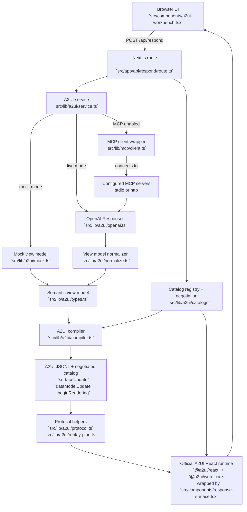
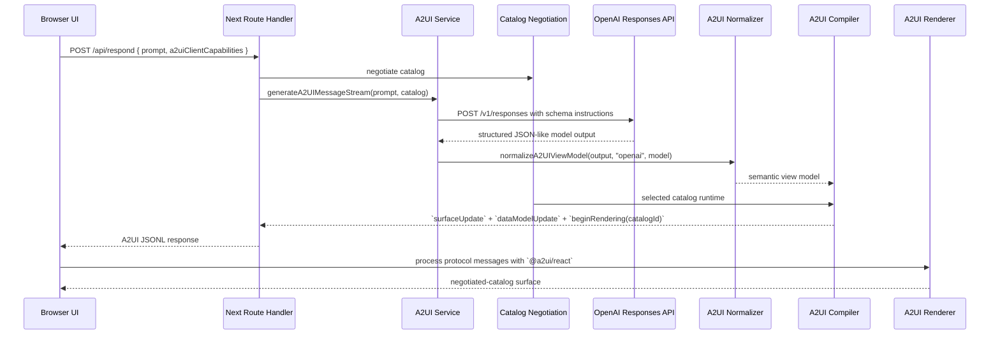

# A2UI

A production-oriented TypeScript A2UI example built with Next.js App Router.

The public wire format now follows an A2UI v0.8-style message stream. Internally,
the server uses a constrained semantic view model and compiles that
into negotiated-catalog A2UI messages with renderer-facing variants before
sending anything to the browser. The client renders those messages through the
official `@a2ui/react` + `@a2ui/web_core` runtime, with this repo only owning
the catalog-role component mappings for its design system. The workbench and
playground only derive lightweight stream summaries for labels and metadata;
they do not materialize component trees outside the official runtime.

The implementation is organized as:

- `src/app`: web entrypoints and the server route
- `src/components`: client-side workbench, playground, catalog registry, and A2UI renderer wrapper
- `src/lib/a2ui/catalogs`: built-in catalogs, inline catalog parsing, and negotiation
- `src/lib/config`: TOML-backed application config loader
- `src/lib/a2ui`: semantic view model types, catalog-aware compiler, protocol utilities, replay planning, mock generator, and OpenAI integration
- `src/lib/mcp`: configurable MCP transport definition and SDK client wrapper
- `config`: local runtime config and checked-in config template
- `scripts`: container startup helpers
- `test`: Node-native tests for the core response shaping logic

## Architecture



How the flow works:

1. The browser submits a user prompt plus `a2uiClientCapabilities` to `POST /api/respond`.
2. The route handler validates input, parses client capabilities, negotiates a compatible catalog, and delegates to the A2UI service.
3. The service chooses either:
   - mock mode for offline development, or
   - a live OpenAI-compatible Responses call when `OPENAI_API_KEY` is configured.
4. If MCP is configured, the server-side agent can list tools across multiple named servers, choose one tool call, fetch live data, and feed that result into the final A2UI generation step.
5. Live model output is normalized into a constrained semantic view model before it reaches the wire.
6. The server compiles that view model against the negotiated catalog, so component names can vary while the semantic model stays stable.
7. The route returns newline-delimited JSON with the chosen `catalogId` in `beginRendering`.
8. The workbench and `/render` page derive a lightweight stream summary for badges and metadata without materializing a second client-side surface tree.
9. The response surface wrapper computes a replay plan, appends unseen suffix messages when possible, and resets only when the stream changes shape.
10. The client hands the message stream to the official A2UI React provider and web-core processor, while this repo supplies the catalog-role component registry used for its custom presentation.

## Live Model Path



Notes:

- The model is still not allowed to define the rendered UI directly.
- The server owns semantic-to-catalog compilation. The model never emits raw component trees directly.
- Catalog negotiation now follows A2UI practice: the client advertises support, the server selects one compatible catalog, and the chosen `catalogId` is returned in `beginRendering`.
- Inline catalogs are supported when they declare the renderer roles needed by this app.
- The official client runtime now owns message processing and tree materialization; this repo only owns catalog negotiation and the role-to-component registry.
- Workbench and playground views only call `summarizeA2UIStream(...)` for metadata and status; they do not run a separate surface materialization pass.
- The response surface wrapper is replay-aware: it appends new suffix messages to existing runtime state and only clears/replays when the incoming stream diverges from what was already processed.
- If the official processor rejects a parseable-but-invalid stream, the wrapper falls back to a warning surface instead of crashing the React render path.
- The renderer registry resolves negotiated component names to local React components and degrades safely when a component type is not implemented locally.
- If the live call fails, the service falls back to the mock generator and records the fallback reason in metadata.

## What it does

The app accepts a user prompt, sends it to `POST /api/respond`, and renders an
A2UI surface instead of plain text only. The server route supports two execution modes:

- Mock mode: enabled by default when `OPENAI_API_KEY` is not set
- Live mode: enabled automatically when `OPENAI_API_KEY` is set

## Run

Create your local config file first:

```bash
cp config/app-config.template.toml config/app-config.toml
```

```bash
npm install
npm run dev
```

Open [http://localhost:3000](http://localhost:3000).

If you already have a captured A2UI JSONL payload and want to render it directly,
open [http://localhost:3000/render](http://localhost:3000/render).

You can also inspect the protocol directly:

```bash
curl -s http://localhost:3000/api/respond \
  -H "Content-Type: application/json" \
  -d '{"prompt":"Plan a production readiness review for a new MCP-backed app."}'
```

That route now returns newline-delimited A2UI messages, not a single JSON object.

## Catalog Negotiation

This repo is now catalog-aware.

- Built-in catalogs live in `src/lib/a2ui/catalogs`
- The browser advertises supported catalog IDs on every request
- The server negotiates the first compatible catalog in preference order
- `beginRendering.catalogId` tells the client which renderer contract was used
- Clients may also send inline catalogs for development or specialized renderers
- Inline catalogs may extend a built-in catalog with `extendsCatalogId` and only override the roles they change
- `beginRendering.styles` is now limited to the v0.8 keys the official web runtime accepts: `font` and `primaryColor`

The current implementation supports:

- `https://rigebha.dev/catalogs/a2ui-reporting/v1/catalog.json`
- `https://rigebha.dev/catalogs/a2ui-panel/v1/catalog.json`
- Inline catalogs that declare the renderer roles used by this app: `column`, `row`, `card`, and `text`

Example request body:

```json
{
  "prompt": "Plan a production readiness review for a new MCP-backed app.",
  "a2uiClientCapabilities": {
    "supportedCatalogIds": [
      "https://example.com/catalogs/inline-panel/v1/catalog.json",
      "https://rigebha.dev/catalogs/a2ui-panel/v1/catalog.json",
      "https://rigebha.dev/catalogs/a2ui-reporting/v1/catalog.json"
    ],
    "inlineCatalogs": [
      {
        "catalogId": "https://example.com/catalogs/inline-panel/v1/catalog.json",
        "title": "Inline Panel Catalog",
        "extendsCatalogId": "https://rigebha.dev/catalogs/a2ui-reporting/v1/catalog.json",
        "components": {
          "Panel": { "type": "object", "x-a2uiRole": "card" },
          "Copy": { "type": "object", "x-a2uiRole": "text" }
        }
      }
    ]
  }
}
```

## Configuration

Runtime environment variables:

```bash
OPENAI_API_KEY=<your-api-key>
A2UI_MODE=mock
```

`A2UI_MODE=mock` forces the offline mock path even if an API key is present.

The app loads its non-secret runtime configuration from `config/app-config.toml`, with the checked-in template at `config/app-config.template.toml`.

The config file supports multiple MCP servers under one file:

```toml
[openai]
model = "gpt-5.4"
base_url = "https://api.openai.com/v1"

[mcp]
active_servers = ["oci_stdio", "oci_http"]

[mcp.servers.oci_stdio]
transport = "stdio"
command = "uvx"
args = ["oracle.oci-cloud-mcp-server"]

[mcp.servers.oci_http]
transport = "http"
url = "http://localhost:8888/mcp"
headers = {}
```

Supported transports:

- `stdio`: the Next.js server spawns the configured process with `command` and `args`
- `http`: the Next.js server connects to `url` with the official MCP TypeScript SDK

Notes:

- The MCP client runs on the server side only. The browser never connects to MCP directly.
- `stdio` requires the target executable to exist in the runtime environment.
- The container image includes `python3`, `uv`, and `uvx` so you can run Python-based MCP servers through `uv` without building a custom app image first.
- The local config file is intentionally ignored by git. Commit only the template.
- The app can define more than one MCP server and will aggregate tools across the configured `active_servers`.

Example `stdio` commands:

```bash
# Direct executable already on PATH
command = "oracle.oci-cloud-mcp-server"
args = []

# Resolve and run via uvx
command = "uvx"
args = ["oracle.oci-cloud-mcp-server"]

# Use uv to run an installed module or project command
command = "uv"
args = ["run", "oracle.oci-cloud-mcp-server"]
```

## Container

Build the image:

```bash
podman build -t a2ui -f Containerfile .
```

Run in mock mode:

```bash
podman run --rm -p 3000:3000 a2ui
```

Run with live OpenAI access:

```bash
podman run --rm -p 3000:3000 \
  -v "$PWD/config/app-config.toml:/app/config/app-config.toml:ro" \
  -e OPENAI_API_KEY=<your-api-key> \
  a2ui
```

Run with a Podman secret named `openai_api_key`:

```bash
podman run --rm -p 3000:3000 \
  -v "$PWD/config/app-config.toml:/app/config/app-config.toml:ro" \
  --secret openai_api_key \
  a2ui
```

The container entrypoint automatically reads `/run/secrets/openai_api_key` when `OPENAI_API_KEY` is not already set.

The container serves the app on `http://localhost:3000`.

### Compose

This project also includes `compose.yaml` for Podman Compose.

Start the app:

```bash
podman compose up --build
```

Stop it:

```bash
podman compose down
```

The compose file expects an external Podman secret named `openai_api_key`.

It also mounts:

- your local `config/app-config.toml` into the container at `/app/config/app-config.toml`
- your local `~/.oci` directory into the container user home at `/home/nextjs/.oci` when using OCI-backed MCP server profiles

The container user home is `/home/nextjs`, so standard OCI CLI lookup works without extra mounts. If your local OCI profile uses host-specific absolute paths for `key_file`, update it to use a home-relative path or mirror that file path inside the container.

If you want to force offline mode with compose, override the environment:

```bash
A2UI_MODE=mock podman compose up --build
```

Edit `config/app-config.toml` to change the model or MCP server definitions.

## Test

```bash
npm test
```

The test suite only exercises the pure TypeScript core. It does not require Next.js to be installed.
