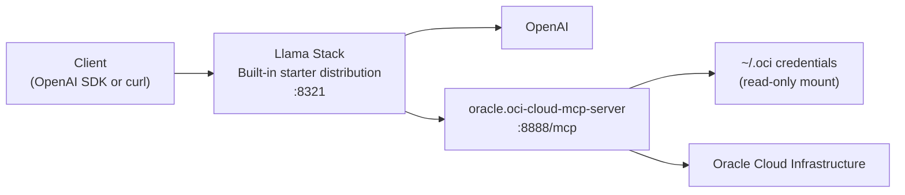

# Llama Stack Starter + OCI MCP

This project runs the standard built-in Llama Stack `starter` distribution and uses OpenAI as the inference provider. An `oracle.oci-cloud-mcp-server` sidecar is included so you can attach OCI tools to Responses API calls.

The shape is:

1. Client sends `POST /v1/responses` directly to Llama Stack.
2. Llama Stack resolves the configured model and calls OpenAI as the inference provider.
3. OCI-specific requests can include an MCP tool pointing at `oracle.oci-cloud-mcp-server`.

## Architecture



## Why this layout

This restart uses the built-in `starter` distribution directly instead of maintaining a custom gateway layer or custom run configuration. That keeps the project aligned with standard Llama Stack behavior and makes the deployment easier to reason about.

- The server endpoint is Llama Stack itself on `http://localhost:8321/v1`
- The runtime is started with `llama stack run starter --port 8321`
- OpenAI is selected by supplying `OPENAI_API_KEY`

For the OpenAI side, this project targets the official Responses API at `POST /v1/responses`: [OpenAI Responses API reference](https://platform.openai.com/docs/api-reference/responses/create?api-mode=responses). Llama Stack exposes an OpenAI-compatible Responses surface at `/v1`: [OpenAI Compatibility](https://llamastack.github.io/docs/next/providers/openai).

## Files

- `compose.yaml`: Podman Compose stack for standard Llama starter plus the OCI MCP sidecar
- `Containerfile.server`: Llama Stack container image
- `examples/client.py`: OpenAI SDK example calling Llama Stack directly
- `scripts/check_upstream.py`: validates the Llama Stack server and prints available models
- `scripts/register_oci_toolgroup.py`: registers a native Llama Stack toolgroup for the OCI MCP sidecar
- `scripts/start-llama-stack.sh`: reads the OpenAI Podman secret and starts `llama stack run starter --port 8321`

## Podman Compose

If you want the full stack in containers, use Podman Compose from this directory:

```bash
printf '%s' 'sk-...' | podman secret create openai_api_key -
```

Then run:

```bash
podman compose up --build
```

That starts:

- `oci-cloud-mcp` on `http://localhost:8888/mcp`
- `llama-stack` on `http://localhost:8321`

To stop it:

```bash
podman compose down
```

To remove the secret when you no longer need it:

```bash
podman secret rm openai_api_key
```

You can then test Llama Stack with:

```bash
curl -s http://localhost:8321/v1/models
```

The compose stack expects your OCI CLI credentials under `~/.oci`, mounted read-only into the `oci-cloud-mcp` container only. The `llama-stack` container does not receive OCI credentials. The sidecar mounts that directory at `/app/.oci`, `/root/.oci`, and `/Users/rigebha/.oci` so both the current branch-based image and older absolute-path OCI configs continue to work inside the container. If you use a non-default OCI CLI profile, set `OCI_CONFIG_PROFILE` before `podman compose up`.

The Llama Stack container is intentionally heavier because it installs the dependency bundle required for the built-in `starter` distribution.

## Quick start

### 1. Create a virtual environment

```bash
cd responses
uv venv -p 3.13
source .venv/bin/activate
uv sync
```

### 2. Start Llama Stack

```bash
export OPENAI_API_KEY=sk-...
uv run llama stack run starter --port 8321
```

### 3. Start the OCI MCP sidecar

```bash
ORACLE_MCP_HOST=127.0.0.1 ORACLE_MCP_PORT=8888 uv run oracle.oci-cloud-mcp-server
```

### 4. Verify Llama Stack connectivity

```bash
uv run python scripts/check_upstream.py
```

### 5. Optionally register a native OCI toolgroup

```bash
uv run python scripts/register_oci_toolgroup.py
```

### 6. Send a Responses API request

Using `curl` directly against Llama Stack:

```bash
curl -s http://localhost:8321/v1/responses \
  -H "Content-Type: application/json" \
  -d '{
    "model": "openai/gpt-5.4",
    "input": "Write a two-line haiku about proxies."
  }'
```

Using the OpenAI SDK against Llama Stack:

```bash
uv run python examples/client.py
```

Using the OCI MCP sidecar inline with a Responses request:

```bash
curl -s http://localhost:8321/v1/responses \
  -H "Content-Type: application/json" \
  -d '{
    "model": "openai/gpt-5.4",
    "instructions": "You are an Oracle Cloud Infrastructure expert assistant. Use the OCI MCP tool and retry after tool-shape errors instead of stopping after the first failure.",
    "input": "List the OCI SDK clients available through the connected OCI MCP server.",
    "tools": [
      {
        "type": "mcp",
        "server_label": "oracle.oci-cloud-mcp-server",
        "server_url": "http://localhost:8888/mcp",
        "require_approval": "never"
      }
    ],
    "max_tool_calls": 8,
    "max_infer_iters": 8
  }'
```

## Supported routes

- `GET /v1/models`
- `POST /v1/responses`
- `GET /v1/responses/{response_id}`
- `POST /v1/responses/{response_id}/cancel`
- `GET /v1/responses/{response_id}/input_items`

Streaming requests with `"stream": true` are passed through as server-sent events.

## Notes

- This project uses the built-in `starter` distribution directly. There is no custom gateway in the active deployment path.
- The compose stack builds Llama Stack from [Containerfile.server](/Users/rigebha/Workspace/mcp-examples/responses/Containerfile.server) and installs a starter-distribution dependency bundle at container build time, so the first build is significantly larger and depends on package registry access.
- The Podman Compose stack expects an external Podman secret named `openai_api_key`; the `llama-stack` container reads that secret from `/run/secrets/openai_api_key`.
- The `oci-cloud-mcp` container reads OCI CLI credentials from `~/.oci` and serves FastMCP over HTTP at `/mcp`, which matches current FastMCP streamable HTTP transport guidance.
- The `oci-cloud-mcp` service is built directly from the local checkout at `/Users/rigebha/Workspace/mcp/src/oci-cloud-mcp-server`, so local branch changes in `rigebha/cloud-enhancements` are what gets deployed.
- The `llama-stack` container only receives the OpenAI Podman secret and does not mount `~/.oci`.
- The current Llama Stack runtime exposes native `toolgroups`, and `scripts/register_oci_toolgroup.py` registers `oci-cloud-mcp`, but Responses MCP calls still require either `server_url` or a native `connector_id`. The inline `server_url` form is the reliable path in this build.
